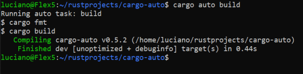

# cargo-auto  

[comment]: # (lmake_readme cargo.toml data start)

[comment]: # (lmake_readme cargo.toml data end)  

[comment]: # (lmake_lines_of_code start)

[comment]: # (lmake_lines_of_code end)

cargo-auto : automation tasks written in Rust language for the build process of rust projects

## Try it

Inside your main rust project directory (the one with Cargo.toml) run:  

```bash
cargo install cargo-auto
cargo auto new
```


Now try to run a task:

```bash
cargo auto build
```



## Motivation

Cargo is a great tool for building rust projects. It has all the basics: `cargo build`, `cargo build --release`, `cargo fmt`, `cargo test`, `cargo doc`,...  
But sometimes we need to do more things like copying some files, publish to ftp or enter long commands. These repetitive tasks must be automated.  
Task automation makes work easier and faster, simplifies the workflow, while improving the consistency and accuracy of workflows.  
This is also sometimes referred to as "workflow automation."  
There are many different build systems and task runners there: `make`, `cmake`, `shell scripts`, `cargo-xtask`, `cargo-make`, `cargo-task`, `cargo-script`, `cargo-run-script`, `runner`, `python scripts`, `powershell scripts`, `cmd prompt scripts`, ...  
Sadly there is no standard in the rust community for now.  
I want something similar to [build.rs](https://doc.rust-lang.org/cargo/reference/build-scripts.html), so I can write my "tasks" in pure rust. I don't want to learn another meta language with weird syntax and difficult to debug. So I will make something really simple, easy, rusty and extensible.  

## cargo auto - automation tasks written in Rust language

Rust is a compiled language. It is not really a scripting or interpreted language. But the compilation of small projects is really fast and can be ignored. Subsequent calls will use the already built binary and so the speed will be even faster.  
This tool is meant for rust projects, so it means that all the rust infrastructure is already in place.  

## automation_tasks_rs helper project

The command `cargo auto new` will create a new directory `automation_tasks_rs` with a template for a helper rust project in the root directory of your `main rust project` . It should not interfere with the main rust project. This directory will be added into git commits and pushed to remote repositories as part of the main project. It has its own `.gitignore` to avoid committing its target directory.  
The `automation_tasks_rs` helper project contains user defined tasks in rust code. This helper project should be opened in a new editor starting from the `automation_tasks_rs` directory. It does not share dependencies with the main project. It is completely separate and independent.  
Basic example:  

```rust
/// automation_tasks_rs basic
fn main() {
    if is_not_run_in_rust_project_root_directory() {
        println!("Error: automation_tasks_rs must be called in the root directory of the rust project beside the Cargo.toml file and automation_tasks_rs directory.");
        // early exit
        std::process::exit(0);
    }

    let mut args = std::env::args();
    // the zero argument is the name of the program
    let _arg_0 = args.next();
    // the first argument is the user defined task: (no argument for help), build, release,...
    let arg_1 = args.next();
    match arg_1 {
        None => print_help(),
        Some(task) => {            
            println!("Running auto task: {}", &task);
            // region: call task functions for the task argument
            if &task == "build" || &task == "b" {
                task_build();
            } else if &task == "release" || &task == "r" {
                task_release();
            } else if &task == "docs" || &task == "doc" || &task == "d" {
                task_docs();
            } else {
                println!("Task {} is unknown.", &task);
                print_help();
            }
            // endregion: call functions for the task argument
        }
    }
}

/// write a comprehensible help for user defined tasks
fn print_help() {
    println!("User defined tasks in automation_tasks_rs:");
    println!("cargo auto build - builds the crate in debug mode");
    println!("cargo auto release - builds the crate in release mode");
    println!("cargo auto docs - builds the docs");
}

// region: tasks

/// example how to call a list of shell commands
fn task_build() {
    #[rustfmt::skip]
    let shell_commands = [
        "echo $ cargo fmt", 
        "cargo fmt", 
        "echo $ cargo build", 
        "cargo build"];
    run_shell_commands(shell_commands.to_vec());
}

/// example how to call one shell command and combine with rust code
fn task_release() {
    println!("$ cargo fmt");
    run_shell_command("cargo fmt");
    println!("$ cargo build --release");
    run_shell_command("cargo build --release");
}

/// example how to call a list of shell commands and combine with rust code
fn task_docs() {
    #[rustfmt::skip]
    let shell_commands = [
        "echo $ cargo doc --no-deps --document-private-items",
        "cargo doc --no-deps --document-private-items",        
        // copy to /docs/ because it is github standard
        "echo $ rsync -a --info=progress2 --delete-after target/doc/ docs/",
        "rsync -a --info=progress2 --delete-after target/doc/ docs/",
        "echo Create simple index.html file in docs directory",
        &format!("echo \"<meta http-equiv=\\\"refresh\\\" content=\\\"0; url={}/index.html\\\" />\" > docs/index.html",&project_directory_name()) ,
        // message to help user with next move
        "echo After successful doc, commit and push changes",
        ];
    run_shell_commands(shell_commands.to_vec());
}

// endregion: tasks

// region: helper functions

/// run one shell command
fn run_shell_command(shell_command: &str) {
    std::process::Command::new("sh")
        .arg("-c")
        .arg(shell_command)
        .spawn()
        .unwrap()
        .wait()
        .unwrap();
}

/// run shell commands from a vector of strings. This could go into a library.
fn run_shell_commands(shell_commands: Vec<&str>) {
    for shell_command in shell_commands {
        run_shell_command(shell_command);
    }
}

/// check if run in rust project root directory error and exit if not
/// there must be Cargo.toml and directory automation_tasks_rs
fn is_not_run_in_rust_project_root_directory() -> bool {
    // return negation of exists
    !(std::path::Path::new("automation_tasks_rs").exists() && std::path::Path::new("Cargo.toml").exists())
}

/// returns the directory name, that is usually also the crate name (for simplicity)
fn project_directory_name()->String{
    std::env::current_dir().unwrap().file_name().unwrap().to_string_lossy().to_string()
}

// endregion: helper functions
```

## cargo auto subcommand

The command `cargo install cargo-auto` will add a new subcommand to cargo:

```bash
cargo auto
```

This binary is super simple. It has only 3 trivial dependencies: `unwrap`, `termion` and `lazy_static`.  
The binary only reads the CLI arguments and runs the `automation_tasks_rs` binary with them. If needed it will compile `automation_tasks_rs` first.  
The code-flow of the source code of `cargo-auto` is simple, fully commented and straightforward to audit. The source code is on [GitHub](https://github.com/LucianoBestia/cargo-auto) with MIT open-source licensing.  

## templates

Inside the cargo-auto project there are 2 directories with rust sub-projects as templates. I can open a new editor for these directories and build this crates independently. So it is easy to debug and develop.  
Sadly, I cannot publish these directories and files to `crates.io`. I can effectively publish only the source code inside my main rust project `cargo-auto`.  
Therefor, before publishing I must copy the text of these files into the modules `template_basic` and `template_with_lib`. It is not difficult now that rust has fantastic [raw strings](https://doc.rust-lang.org/rust-by-example/std/str.html).  

## template_basic

The command  

```rust
cargo auto new
```

will copy the `template_basic` into `automation_tasks_rs` directory.  
This has no dependencies at all, except `std`. It is really simple to understand how it works.  
Open the directory `automation_tasks_rs` in a new editor, explore and add your own tasks in rust code. It is a plain CLI rust project, you can do everything you need with it. Add dependencies and stuff. No limits. This helper project will be added to you commits and stay part of your project.  
Then in the main project run your task (the task name here is `build`):  

```rust
cargo auto build
```

Your code will be compiled (if needed) and executed.  

## template_with_lib

This is a work in progress.  
The goal is to create a library crate [cargo_auto_lib](https://github.com/LucianoBestia/cargo_auto_lib) with many functions that are commonly used when building rust projects.  

```rust
cargo auto new with_lib
```

## development

This crate does not use itself for automation. It is so simple, that cargo alone is enough.  
Usually I compile and run the code with added arguments like this:  

```bash
cargo run -- new
cargo run -- build
cargo run -- release
```

After my first publish to crates.io I discovered that the position of the argument changes if it is used as:  
`cargo-auto new`      - new is 1st arg  
or  
`cargo auto new`      - new is 2nd arg  

## cargo crev reviews and advisory

We leave in times of danger with `supply chain attacks`.  
It is recommended to always use [cargo-crev](https://github.com/crev-dev/cargo-crev)  
to verify the trustworthiness of each of your dependencies.  
Please, spread this info.  
You can also read reviews quickly on the web. Example for the crate `num-traits`:  
<https://web.crev.dev/rust-reviews/crate/num-traits/>  

## open-source free and free as a beer

My open-source projects are free and free as a beer (MIT license).  
I just love programming.  
But I need also to drink. If you find my projects and tutorials helpful, please buy me a beer or two donating on my [paypal](https://www.paypal.com/paypalme/LucianoBestia). You know the price of a beer in your local bar ;-)  
So I can drink a free beer for your health :-)  
[Na zdravje](https://translate.google.com/?hl=en&sl=sl&tl=en&text=Na%20zdravje&op=translate) !
